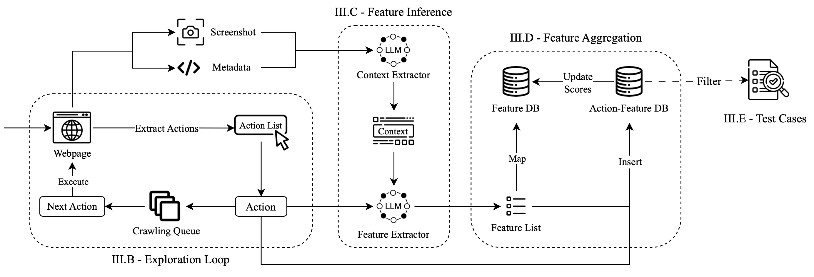

# AutoE2E
Source code and benchmark subjects for "AutoE2E: Feature-Driven End-To-End Test Generation."



## Requirements
Install the required packages using the following command:
```bash
pip install -r requirements.txt
```

## Usage
Before running the project, you need to set the environment variables in the `.env` file. This includes:

1. `APP_NAME`: The name of the application you want to generate E2E test cases for. This needs to match one of the configs in `./configs` folder.
2. `ANTHROPIC_API_KEY`: The API key for the Anthropic platform. You can get this by signing up at [Anthropic](https://anthropic.com/).
3. `ATLAS_URI`: The MongoDB Atlas URI for storing the Action-Feature Database (AFD) and Feature Database (FD).

Then you can run the project using the following command:
```bash
python main.py
```

## LLM Prompts
The prompts used for different parts of our workflow is available in `./autoe2e/prompts.py` file. We use the following prompt for context extraction:

> Given the provided information about a webpage, your task is to provide a brief and abstract description of the webpage's primary purpose or function.
> Output Guidelines:
> * Brevity: Keep the description concise (aim for 1-2 sentences).
> * Abstraction: Avoid specific details or variable names. Use general terms to describe the content and function. (Example: Instead of "a page showing results for searching for a TV," say "a page displaying search results for a product query.")
> * Focus on Purpose: Prioritize describing the main intent of the page. What is it designed for the user to do or learn?
> * No Extra Explanations: Just provide the context. Avoid adding commentary or assumptions.


and the following for feature extraction:


> Given a webpage's purpose and content (webpage_context), the outerHTML of an action element (action_element), and optionally the user's last action that led to this state, your task is to infer the most likely functionalities associated with that action element.
> These functionalities should be user-centric actions that produce measurable outcomes within the application, are testable through E2E testing, and are essential to the presence of the action element.
> Output Format:
> Your is enclosed in two tags:
> \<Reasoning>:
> - An enumerated list of at most five functionalities potentially connected to the element.
> - For each functionality, answer the following questions concisely:
>     1. Would developers write E2E test cases for this in the real world? It should be non-navigational, not menu-related, and not validation.
>     2. Is the functionality a final user goal in itself or is it always a step in doing something else?
>     3. Is this overly abstract/vague? If so, break it down into more testable sub-functionalities.
> - Avoid repeating the questions in your responses every time.
> \<Response>:
> - A JSON array of objects, each containing:
>     - probability: (0.0 to 1.0) Likelihood of this functionality exists.
>     - feature: A concise description of the user action (e.g., "add item to cart").
> - Sorted by probability in descending order.
> - Parsable by `json.loads`.
> - Can be an empty array if no valid functionalities are found.


Furthermore, the baseline prompts are available in `./baseline-prompts.md`.

## Subjects
The subjects used in our evaluations are available in `./benchmark` folder. Furthermore, the server created for tracking the execution of features is available in `./benchmark/_log-server` folder. You need to have a `Redis` server installed and running to be able to use the server.

To run the server:

```bash
cd benchmark/_log-server

pip install -r requirements.txt

flask --app extract.py --debug run
```

### Server Endpoints
The server has the following endpoints:

1. `/start-evaluate/<app-name>`: Start the coverage evaluation for the given application.
2. `/end-evaluate`: End the coverage evaluation for the given application. It will return the coverage rate.

To test the server, you can run the `PetClinic` application located in `./benchmark/pet-clinic` and use the server.